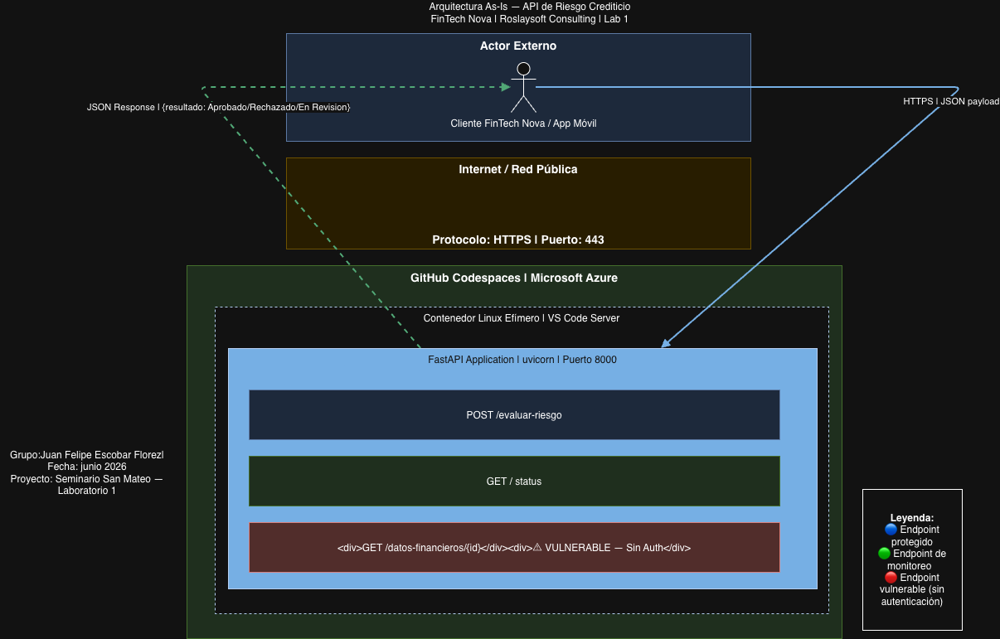

# FinTech Nova — Motor de Riesgo Crediticio
> API de evaluación de créditos — Roslaysoft Consulting

## Integrantes del Grupo
| Nombre | GitHub User | Rol |
|--------|-------------|-----|
| [Tu nombre] | @Juannnnnnn23 | Coordinador |

## Laboratorio 1 — Estado: COMPLETADO

### URL del Codespace
[Pega aquí la URL pública de tu Codespace con /docs al final]

### Endpoints disponibles
| Endpoint | Método | Descripción |
|----------|--------|-------------|
| /status | GET | Health check del sistema |
| /evaluar-riesgo | POST | Motor de scoring crediticio |
| /datos-financieros/{id} | GET | Historial (VULNERABLE - Lab 2) |

### Diagrama Arquitectónico As-Is


## Cómo ejecutar
```bash
pip install -r requirements.txt
uvicorn main:app --host 0.0.0.0 --port 8000 --reload
```